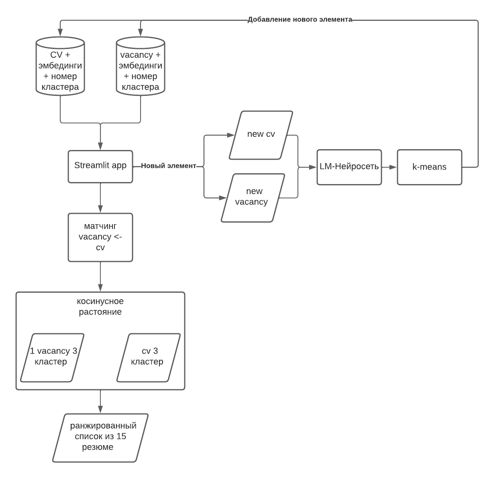
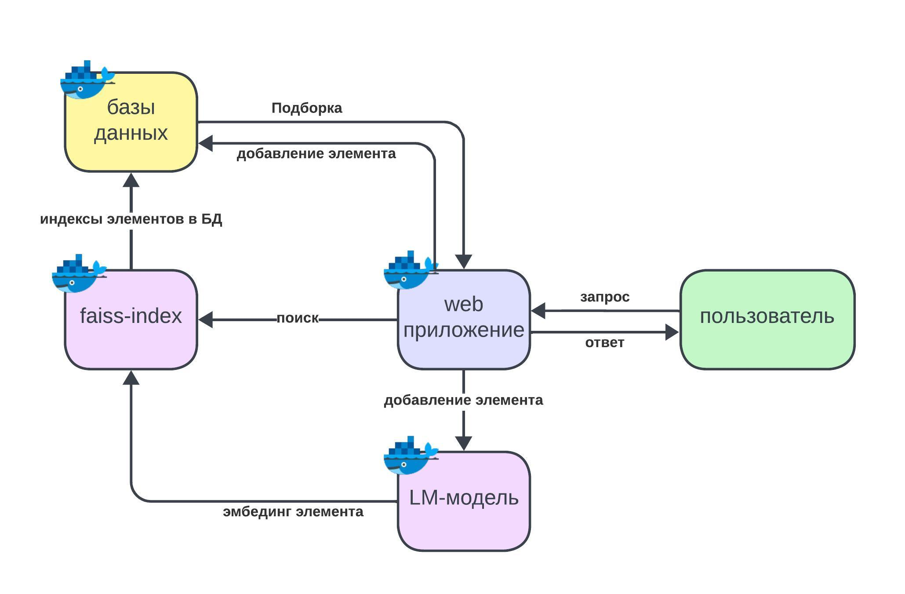

# CareerRank, - сервис для подбора походящих друг другу вакансий и резюме

# Описание проекта

CareerRank - помогаем талантам найти места для их реализации!

Мы предлагаем сервис для подбора походящих друг другу вакансий и резюме.
Мы используем нейросетевые языковые модели (LM) для подбора 
подходящих друг другу вакансий и резюме на основе их текстовых описаний.

Сервис использует модель работающую с русском и английским языком.
Это актуально для ит-вакансий и резюме, когда текст описания может быть на русском языке, но содержать термины из ит области на английском языке, например `DevOps`, `Data Scientist` и т.д.


Видео демонстрация работы сервиса([ссылка](https://youtu.be/ThIdllGH9ug)).

# Структура проекта

Структура проекта была создана под вдохновением от `Cookiecutter Data Science template` ([link](https://github.com/drivendata/cookiecutter-data-science)).

Исходная структура данного шаблона показалась нам перегруженной для небольшого проекта со сроком выполнения 2 недели.

Мы создали упрощенный вариант, который всегда может быть расширен, компонентами структуры исходного шаблона по мере необходимости и развития проекта.

Структура нашего проекта выгладит так

```
├── LICENSE            <- The MIT License (MIT).
├── README.md          <- Описание проекта README ля других разработчиков использующих проект.
├── data
│   ├── analysis       <- Данные используемые для анализа. Например, кропы с представителями классов дорожных знаков.
│   ├── external       <- Данные из других источников. Например, видео с YouTube для теста работы нашей модели.
│   ├── interim        <- Преобразованные датасеты для более удобного использования, но еще не в форме для обучения модели.
│   ├── processed      <- Финальная версия датасета используемая для обучения моделей.
│   └── raw            <- Датасеты в своей исходной форме.
│
├── models             <- Обученные и сериализованные модели и их метрики.
│
├── notebooks          <- Jupyter notebooks. Ноутбуки для исследования и анализа данных.
│
├── reports            <- Отчеты по анализу данных в виде Excel, HTML, PDF, LaTeX, etc.
│   └── figures        <- Графики и диаграммы в виде картинок используемые для отчетов или документации.
│
├── pyproject.toml     <- Мы используем poetry для создания виртуальной среды для разработки.
│
├── src                <- Source code используемый в данном проекте.
    │
    ├── data           <- Скрипты для обработки данных
    │
    ├── models         <- Скрипты для обучения моделей и упаковки их в архив для сохранения в облаке.
    │
    └── visualization  <- Скрипты для визуализации данных. Например, для визуализации кропов классов дорожных знаков.
```

# Code style

Для соблюдения единого стиля оформления кода используются Black([ссылка](https://marketplace.visualstudio.com/items?itemName=ms-python.black-formatter)) и isort([ссылка](https://marketplace.visualstudio.com/items?itemName=ms-python.isort)) плагины для VS code.

# Развернуть рабочее окружение

Проект использует `poetry` для управления зависимостями.
Устанавливаем `poetry` в нашу систему если он не установлен согласно офф. документации ([ссылка](https://python-poetry.org/docs/)).

Для создания виртуального рабочего окружения с `poetry` выполняем команду:
```
poetry install
```

Для его активации выполняем команду:
```
poetry shell
```

# Схема работы сервиса



## Построение поискового индекса Faiss

Мы берем текстовые описания (`src/models`) для
* вакансий из колонок "name", "description"
* резюме из колонок "Ищет работу на должность:", "Опыт работы"

получаем эмбединги текстовых описаний с помощью предобученных моделей:
* `cointegrated/rubert-tiny2` ([ссылка](https://huggingface.co/cointegrated/rubert-tiny2))

* `DeepPavlov/distilrubert-tiny-cased-conversational` ([ссылка](https://huggingface.co/DeepPavlov/distilrubert-tiny-cased-conversational))

* `cointegrated/LaBSE-en-ru` ([ссылка](https://huggingface.co/cointegrated/LaBSE-en-ru))

Строим индекс Facebook Faiss отдельно для всех вакансий и отдельно для всех резюме.

Сохраняем их в папку `src/streamlit_app/data`.

## Анализ точности и производительности моделей

### Характеристики оборудования на котором производилось тестирование сервиса

**CPU:**
Core i5-12600
6 ядер x 3.3-4.8 ГГц, 12 потоков, L2 - 7.5 МБ, L3 - 18 МБ, 2 х DDR4, DDR5-4800 МГц

**RAM:**
DDR4, 32 Гб, 3600 МГц (18-22-22-42)

**SSD M.2 накопитель:**
1000 ГБ, чтение 3500 Мбайт/сек, запись 3300 Мбайт/сек

**GPU:**
nVidia A10 PCIe
24 Гб RAM, производительность FP32: 31.24 TFLOPS

### Требования к системе

Длинны текстового эмбединга у различных моделей:
* LaBSE-en-ru - 768
* DeepPavlov/distilrubert-tiny-cased-conversational - 768
* cointegrated/rubert-tiny2 - 312

Вычисление эмбедингов для текстов производится батчами по 256 текстов.
А вот базы данных в виде csv-файлов загружаются полностью в RAM сервера.

Базовым требованием к работе системы с текущими объемами данных является:

* наличие 16 Гб RAM для CPU (чтобы вмещать в себя данные из CSV-файлов)
* GPU с 2 Гб RAM (чтобы вмещать в нее расчет эмбедингов для 256 текстов)

Для большей производительности можно увеличить батч текстов до 1024, тогда требования для RAM ГПУ будут увеличены до 8 Гб, но такой объем памяти есть в наличии почти у всех современных ГПУ.

# Использованные датасеты

Мы использовали датасеты:
 * с базой данных резюме с HeadHunter.ru ([ссылка](https://drive.google.com/file/d/1ikA_Ht45fXD2w5dWZ9sGTSRl-UNeCVub/view?usp=share_link)) 

(44576 rows × 12 columns)

 * с базой данных вакансий с HeadHunter.ru ([ссылка](https://t.me/c/1994322130/450))
  
(96223 rows × 17 columns)

### Измерение производительности моделей

Измерение производительности осуществлялось засечением времени создания индекса функцией `create_faiss_index` с помощью декоратора `timer_decorator` в `src/models/faiss_utils.py`.

Засекали время для построения faiss-индекса:
* для резюме `create_index_resume`, 44576 векторов
* для вакансий `create_index_vacancy`, 96223 векторов

Даная процедура состоит из

* извлечение текста из баз данных (csv-файла)
* вычисления эмбедингов с помощью языковой модели (LM)
* создания и сериализация faiss индекса с полученными эмбедингами

Для каждой модели продолжительность этого этапа отличается только временем создания эмбедингов.

Данный показатель пропорционален производительности модели.

Пример записанных логов

```
data/faiss_index/rubert-tiny2/resume_db.index
Function 'create_faiss_index' executed in 280.8321s

data/faiss_index/rubert-tiny2/vacancy_db.index
Function 'create_faiss_index' executed in 133.4256s

data/faiss_index/DeepPavlov_distilrubert-tiny-cased-conversational/resume_db.index
Function 'create_faiss_index' executed in 97.0770s

data/faiss_index/DeepPavlov_distilrubert-tiny-cased-conversational/vacancy_db.index
Function 'create_faiss_index' executed in 157.9682s

data/faiss_index/LaBSE-en-ru/resume_db.index
Function 'create_faiss_index' executed in 252.5127s

data/faiss_index/LaBSE-en-ru/vacancy_db.index
Function 'create_faiss_index' executed in 652.4580s
```

### Измерение точности моделей

Мы ввели следующую методику ручной оценки качества выдачи рекомендаций нашего сервиса.

Скрипты

* `src/models/get_cvs_for_vacancy.py` - выбирает случаиные 10 вакансий с фиксированным seed и подбирает под каждую из них 10 наиболее подходящих резюме. Выбранная вакансия сохраняется в csv-файл, и подобранные к ней резюме тоже сохраняются в csv-файл.
* `src/models/get_vacancies_for_cv.py` - выбирает случайные 10 резюме с фиксированным seed и подбирает под каждую из них 10 наиболее подходящих вакансий. Выбранное резюме сохраняется в csv-файл, и подобранные к ней вакансии тоже сохраняются в csv-файл.

Наборы вакансий и резюме к которым модели делают подборки у нас одинаковы для всех моделей благодаря фиксированному seed.

Качество рекомендаций моделей оценивалось следующим образом:

Брали описание вакансии, например - `data/analysis/rubert-tiny2/cvs_for_vacancy/vacancy_3278.csv`
Читали ее описание, и смотрели подборку резюме от модели `rubert-tiny2` для нее `data/analysis/rubert-tiny2/cvs_for_vacancy/vacancy_3278_10_resumes.csv`.

Каждая рекомендация по резюме кандидата которая +/- подходила на вакансию получала 1 балл.

Поскольку мы рекомендуем топ 10, максимальное количество баллов для одной подборки, - 10 баллов. Нормируем это значение на максимально возможный балл, т.е. на наш topn.

Мы считали баллы отдельно для каждой подборки по всем вакансиям и усредняли их между собой, получалось значение `cvs_for_vacancy` для данной модели (`rubert-tiny2`).

Таким же образом, оценивались подборки вакансий к резюме от моделей. Данная метрика показана в таблице в столбце `vacancies_for_cv`

### Сводная таблица результатов

| model                                             | topn | cvs_for_vacancy | vacancies_for_cv | Average | create_index_resume, s | create_index_vacancy, s | overal time, s |
|---------------------------------------------------|------|-----------------|------------------|---------|------------------------|-------------------------|----------------|
| rubert-tiny2                                      | 10   | 0.38            | 0.35             | 0.365   | 281                    | 133                     | 414            |
| DeepPavlov_distilrubert-tiny-cased-conversational | 10   | 0.15            | 0.18             | 0.165   | 97                     | 158                     | 255            |
| LaBSE-en-ru                                       | 10   | 0.48            | 0.43             | 0.455   | 253                    | 652                     | 905            |

Эмбединги от необученного `DeepPavlov_distilrubert-tiny-cased-conversational` дают самый низкий результат, хотя данная модель и является самой быстрой из всех. Возможно причина невысоких результатов заключается в том, что модель работает только с русским языком. В нашем датасете много англоязычных терминов, есть даже вакансии и резюме написанные полностью на английском языке.

Эмбединги от необученного `rubert-tiny2` дают хороший результат для популярных профессий, при этом модель довольно быстрая. Данная модель поддерживает два языка, - английский и русский.

Эмбединги от необученного `LaBSE-en-ru` дают самый лучший результат для популярных профессий, при этом модель имеет самую низкую производительность из всех. Данная модель поддерживает два языка, - английский и русский.

Если сервису важнее 
* более высокое качество рекомендаций, лучше использовать `LaBSE-en-ru`
* если производительность, то `rubert-tiny2`

Было бы интересно сравнить обученные модели между собой.

## Запуск Streamlit web-приложения

Теперь мы можем запускать web-приложение Streamlit (`src/streamlit_app`) командой

```
cd src/streamlit_app
streamlit run homepage.py
```

Перейдя по адресу показанному в терминале Streamlit в нашем браузере откроется home страница веб-приложения:


# Дальнейшее развитие и масштабирование сервиса

Сейчас сервис представляет собой прототип в виде PoC.

Для перехода от прототипа к первой версии реального сервиса нужно сделать изменения.

## Разделение сервиса на отдельные компоненты

Разделим сервис на отдельные компоненты:



1. web-приложение. (Сейчас это Streamlit. CPU-сервер)
   * предоставляет веб UI для пользователя
   * дает возможность для загрузки своих вакансий или резюме
   * дает возможность осуществлять запросы на поиск рекомендуемых подборок вакансий и резюме

2. LM-модель (LM-модель с Fast API для получения и POST/GET запросов и ответов. GPU-сервер)
   * создает эмбединги из присланного ей текста вакансии

3. faiss-индекс (faiss-index с Fast API для получения и POST/GET запросов и ответов. Возможен как CPU, так и GPU-сервер, можно выбрать на основе нагрузки)
   * реализует faiss-индекс для быстрого поиска подборок вакансий и резюме на основе близости эмбедингов от их текстовых описаний
   * отправляет индексы наиболее походящих резюме и вакансий для агрегации соответствующих элементов из Баз данных

4. Базы данны (сейчас это Pandas работающий с csv-файлами. Лучше заменить его на нормальную БД, например, PostgreSQL. CPU-сервер)
   * реализует добавление нового элемента в БД
   * отдает подборку по индексам элементов БД, полученными от faiss

Особенности:
 * Каждый компонент общается с другими по средствам  POST/GET запросов и ответов.
 * Каждый компонент независим от других и легко может быт заменен аналогом поддерживающим тот же унифицированный API для обмена сообщениями
 * Каждый компонент представляет собой отдельный Docker-контейнер. С одной стороны это позволит контейнеризовать рабочее окружение необходимое для работы каждого компонента. С другой даст возможность масштабирования сервиса путем увеличения числа нужных для обслуживания пользователей компонентов (горизонтальное масштабирование).